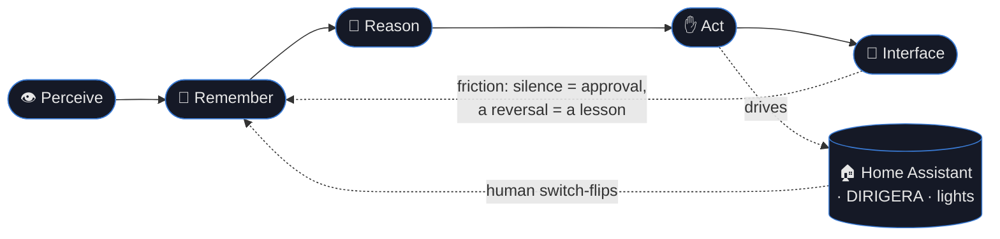
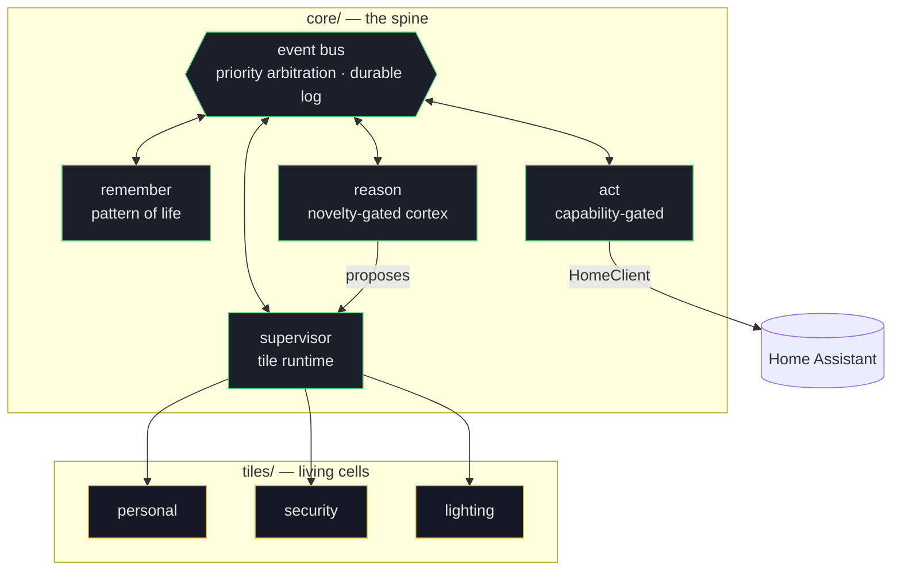
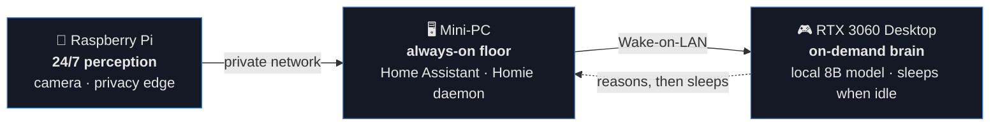

<div align="center">

# 🏠 Homie

**A private, local-first home intelligence — it perceives your home, learns its rhythm, and acts on it, entirely on hardware you own.**

No cloud. No accounts. No telemetry. Nothing ever leaves your network.

[](tests/)
[](https://www.python.org/)
[](#engineering-discipline)
[](#security--privacy)
[](os/INSTALL.md)
[](docs/PROGRESS.md)

</div>

---

Homie is a self-hosted home AI that runs headless on your own machines, on its own hardened
operating system. It watches the home through devices you control, builds a **pattern of life**,
and learns by *friction* — silence is approval, a correction is a lesson — so it needs you less
over time. The inspiration is *The Machine* from *Person of Interest*: quiet, resilient,
ever-present — reimagined as something personal, private, and entirely yours.

> **Design stance.** The model is untrusted by construction. Safety is a property of the
> *architecture* — a priority-arbitrated bus, per-tile capability grants, and a positive-schema
> privacy fence — not of any single component's good behaviour. That is what makes it safe to run
> an uncensored local model as the brain.

## Table of contents

- [Why Homie](#why-homie)
- [How it works](#how-it-works)
- [The always-on topology](#the-always-on-topology)
- [What works today](#what-works-today)
- [Quickstart](#quickstart)
- [Install as its own OS](#install-as-its-own-os)
- [Project structure](#project-structure)
- [Engineering discipline](#engineering-discipline)
- [Security & privacy](#security--privacy)
- [Roadmap](#roadmap)
- [Documentation](#documentation)
- [License](#license)

## Why Homie

| | |
|---|---|
| 🔒 **Local-first** | Perception and reasoning run on your hardware. Data stays on your network — encrypted at rest, never sent anywhere. |
| 🧠 **Learns by friction** | No rules to write. It proposes, you correct, it remembers — a decayed, pattern-of-life model that forgets stale habits and adapts. |
| 🧩 **Modular by tiles** | Capability is added as self-contained *tiles* (living cells: self-learning, self-healing), never by touching the core. |
| 🛡️ **Safe by structure** | A priority floor — *safety > security > automation > convenience > ambient* — is enforced by the bus, and every actuation carries a capability handle the trusted core mints. |
| 🌙 **Ambient & resilient** | Headless, text-first, and meant to disappear into the home. *Designed* to span your devices over an encrypted mesh — the seam is built; today it runs single-node. |
| ⚡ **Frugal** | The heavy GPU brain wakes only when a moment is genuinely novel (an event-clocked surprise budget), and sleeps the rest of the time. |

## How it works

A minimal **core** and a colony of **tiles** compose one five-part loop. *Remember* (behavioral
analysis) is the heart; the *Interface* is voice-first.



Everything is assembled by a **single keystone** — `build_daemon()` — so production, the demo, and
the entire test suite drive the *same* wiring, differing only by what is injected (the home client,
the perception source, the model). A green test suite is therefore a proof the shipped daemon works;
there is no second code path for production to diverge into.



## The always-on topology

Homie is **tiered**, so the lightweight learning floor never depends on the power-hungry brain
being awake.



- **Pi** — a 24/7 lightweight perception + learning floor at the privacy edge; raw frames never leave it.
- **Mini-PC** — always-on, runs Home Assistant and the Homie daemon so the home keeps working while the brain sleeps.
- **RTX 3060 desktop** — the heavy reasoning brain, kept in suspend-to-RAM and woken on demand (seconds) only when a moment is novel, then put back to sleep.

## What works today

| Capability | Status | What it means |
|---|---|---|
| **Event bus + durable log** | ✅ | Async, priority-arbitrated, crash-safe append-only log with compaction. |
| **Behavioral analysis** | ✅ | Decayed pattern-of-life model — answers "what is normal here, now?" and forgets stale habits. |
| **Tile runtime** | ✅ | In-process **and** subprocess isolation, supervision, self-healing, hot-swappable tiles. |
| **Friction learning** | ✅ | Reversals become lessons; home-echo canonicalization stops Homie mis-reading its own actions. |
| **Capability-gated actuation** | ✅ | A tile drives only what its manifest declares, at its declared priority — a forged command is refused, even over the subprocess wire. |
| **Wake governance** | ✅ | An event-clocked surprise budget wakes the GPU brain only on genuinely novel moments and reports the real asleep-fraction as a number; safety wakes are exempt. |
| **Home Assistant adapter** | ✅ | Drives real DIRIGERA/Tradfri lights and hears human switch-flips, over a stdlib WebSocket with a liveness heartbeat. |
| **Self-pacing voice** | ✅ | One global governor on unprompted speech that *learns* how chatty to be — muting it shrinks its allowance, a tolerated day grows it; safety always heard, overflow defers. No hand-set cap. |
| **Honest beliefs** | ✅ | Every learned routine is a true probability in [0,1] that mean-reverts when a habit stops; a coincidence is never stated as fact. |
| **Morning surface** | ✅ | A plain "what Homie knows" page + a daily recap (yesterday) and briefing (today's agenda + a sensible errand order), capped so it never floods. |
| **Serving discipline** | ✅ | Local-model latency SLO, warm/cold GPU policy, and JSON-schema-constrained tool decoding (the GPU brain itself is not yet stood up). |
| **Distilled memory (GIST)** | 🔬 | A deterministic, integer-exact "field notebook" of the home's rhythm — the integer core is built; the full format is in design ([spec](docs/MEMORY-GIST.md)). |
| Privacy guard · undo · voice · camera head | ⏳ | On the roadmap (M7–M11). |

**443 stdlib tests pass** — and the tested graph *is* the shipped graph.

## Quickstart

Python 3.11+, **standard library only** — no dependencies to run the spine.

```sh
git clone https://github.com/kezystry/homie.git && cd homie

python3 -m unittest discover -s tests   # the full suite (443 tests)
python3 scripts/spine_demo.py           # the five-part loop, end to end on one node
python3 scripts/status.py --text        # a live status board (great over SSH)
python3 scripts/run.py                  # the daemon (bus + Remember + Supervisor + tiles)
```

Connect it to a real home (drive lights, hear switch-flips) by pointing it at Home Assistant:

```sh
export HOMIE_HOME_URL=ws://mini-pc.local:8123/api/websocket
export HOMIE_HOME_TOKEN=<long-lived-access-token>   # HA → Profile → Security
python3 scripts/run.py
```

Add the local reasoning brain by serving an OpenAI-compatible endpoint and setting
`HOMIE_LLM_URL` (see [`deploy/MODEL.md`](deploy/MODEL.md)). Unset, Homie runs its anchor floor
with no GPU dependency.

## Install as its own OS

Homie ships a hardened, text-first **NixOS** profile that **dual-boots alongside your existing OS**
on a LUKS-encrypted partition and boots straight into the daemon. Your existing OS is preserved and
chainloaded from the boot menu — Homie never writes to it. Every `nixos-rebuild` is a new,
rollback-able generation, and the box updates itself via a pull → health-check → restart channel.

→ **[os/INSTALL.md](os/INSTALL.md)** · guided walkthrough: **[docs/WALKTHROUGH.md](docs/WALKTHROUGH.md)**
· connect the lights: **[docs/HA-SETUP.md](docs/HA-SETUP.md)** (Home Assistant + DIRIGERA bulbs)

## Project structure

```
core/        the spine: bus · remember · reason · act · reconcile · tile runtime ·
             capability · wake_ledger · serving · ha · ws · canonical · ritual · mesh …
tiles/       living tiles — personal · security · lighting — + _template for new ones
tests/       stdlib unittest suite (47 files, 443 tests)
scripts/     run.py (daemon) · spine_demo.py (demo) · status.py (live board) · update.py
os/          dual-boot hardened NixOS profile + INSTALL.md
deploy/      runtime config — act_map.toml · llm.py · home.py · MODEL.md (model card)
docs/        design & engineering docs + audits/ (external reviews)
obsidian/    the same notes as a cross-linked, importable Obsidian vault
```

## Engineering discipline

- **Stdlib only where feasible.** The runtime spine pulls in *zero* third-party packages — even the
  WebSocket client to Home Assistant is hand-written on `asyncio`. Reproducible on a headless box, no pip.
- **One wiring.** `build_daemon()` is the single assembler; a golden-loop test makes a
  production/test divergence structurally impossible.
- **Determinism is a gate.** Decay is memoryless and replay-stable; the GIST memory core round-trips
  byte-for-byte under a fuzz corpus, with no float crossing the serialization boundary.
- **Significant decisions go through a panel** of role-played domain professionals, then a chaired
  synthesis — recorded under [`docs/audits/`](docs/audits/). The memory format alone was stress-tested
  by a 21-agent brainstorm and a 7-agent ratification.
- **Honest records.** [`docs/PROGRESS.md`](docs/PROGRESS.md) tracks every milestone with its test
  count and commit; a milestone is "shipped" only when its named acceptance test passes.

## Security & privacy

- **Nothing leaves the machines.** No cloud, no accounts, no telemetry. Online access is opt-in and,
  when used, routed safely (e.g. VPN / Tor).
- **Off-limits by absence.** Spaces that must never be observed (e.g. a housemate's flat) get *no
  representation at all* — the memory format cannot even express them.
- **No raw biometrics persisted.** Identity appears only as enrolled household labels; faces/audio are
  never stored or sent across the mesh.
- **Encrypted + reversible.** At-rest confidentiality via LUKS; memory is password-reversible
  ("lock, don't lose") with a panic-wipe. A nightly ritual discards raw logs and keeps only the
  distilled, inspectable pattern of life.
- **Least privilege.** Every actuation carries a capability handle bound to the requesting tile,
  its actuator, and its declared priority; the bus arbitrates and an act-map `never_touch` list is an
  absolute outer boundary.

See [docs/SECURITY.md](docs/SECURITY.md). Reviews live in [docs/audits/](docs/audits/).

## Roadmap

Shipped **M0–M6** (the reasoning spine, wake governance, capability gate, the Home Assistant hand,
serving discipline). Next:

| Milestone | Theme |
|---|---|
| **M7** | Positive-schema privacy guard + Dream Journal (GIST retrieval) |
| **M8** | Friction-ledger pane + one-key undo |
| **M9** | Deploy posture + OS confinement |
| **M10** | Visible posture + trust tiers ("see what Homie knows") |
| **M11** | Nightly self-refresh: hygiene · self-heal · self-upgrade · restart |

Full detail in [docs/MASTERPLAN.md](docs/MASTERPLAN.md) · live status in [docs/PROGRESS.md](docs/PROGRESS.md).

## Documentation

| Doc | What it covers |
|---|---|
| **[CHARTER](docs/CHARTER.md)** | **the Gerüst — the binding, non-negotiable rules + must-exist features** |
| [SCOPE](docs/SCOPE.md) · [GOALS-AUDIT](docs/GOALS-AUDIT-2026-06-28.md) | the near-term scope filter + every wanted feature vs its status |
| [OVERVIEW](docs/OVERVIEW.md) · [DESIGN](docs/DESIGN.md) | the big picture and why it works this way |
| [ARCHITECTURE](docs/ARCHITECTURE.md) · [INTERNALS](docs/INTERNALS.md) | how it's built and the engineering decisions |
| [PROTOCOL](docs/PROTOCOL.md) | the tile wire protocol |
| [SECURITY](docs/SECURITY.md) | privacy, encryption, identity scope |
| [MEMORY-GIST](docs/MEMORY-GIST.md) | the distilled-memory format (design + ratification) |
| [PLAN](docs/PLAN.md) · [BRINGUP](docs/BRINGUP.md) | hardware build plan + the order to make it physical |
| [MASTERPLAN](docs/MASTERPLAN.md) · [PROGRESS](docs/PROGRESS.md) | the crafted plan + the living status board |

Prefer a graph view? Open the [`obsidian/`](obsidian/) folder as a vault.

## License

Not yet licensed — all rights reserved by the author pending a license decision. Please open an
issue if you'd like to use or contribute to Homie.

<div align="center">
<sub>Built in the open, for one home first. Quiet, resilient, ever-present.</sub>
</div>
